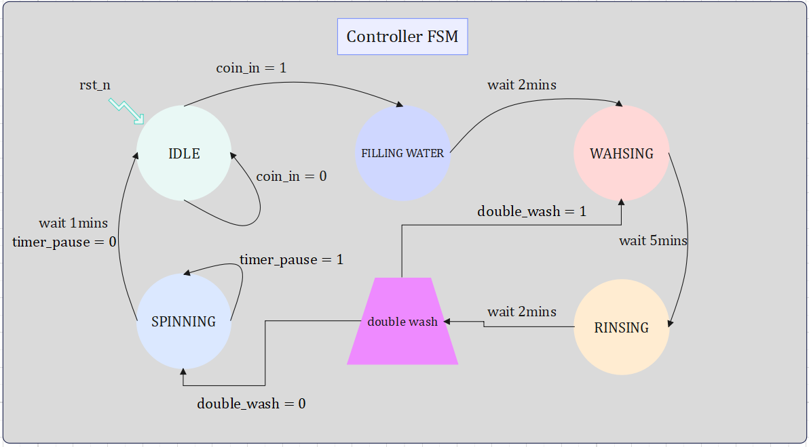

# Washing Machine Controller

## An RTL modelling for a wash machine controller, using Verilog HDL.

### Summary

It is required to design a controller for a washing machine which has the following states:

*   IDLE
*   FILLING WATER
*   WASHING
*   RINSING
*   SPINNING

also supports the following:

*   A double wash option.
*   A timer pause during the spinning phase.
*   A multiple operating frequencies.
*   An asynchronous active low reset.

**Table of contents**

- [Summary](#summary)
- [Operation Flow](#operation-flow)
    - [State Transitions](#state-transitions)
    - [Features](#features)
        - [Reset](#reset)
        - [Operation Frequencies](#operation-frequencies)
        - [Double Wash](#double-wash)
        - [Timer Pause](#timer-pause)
- [Test Bench](#test-bench)

### Operation Flow

#### State Transitions

At the beginnig we reset the system by asserting the *rst_n* input to logic low, thus the system enters the *IDLE* state, then the system waits for a coin to be deposited which sets the input *coin_in* to logic high, afterwards the system enters the operating states, At first it enters the *FILLING WATER* state in which the washing machine gets filled with water for a duration of **2 minutes**, then it automatically goes to the *WASHING* state in which the machine starts washing for a duration of **5 minutes**, then it automatically goes to the *RINSING* state in which the machine stays for a duration of **2 minutes**, at the end the machine enters the *SPINNING* state in which it spins for a duration of **1 minutes**, and finally goes to the *IDLE* state for another round.

#### Features

##### Reset

*   The controller has an asynchronous active low reset, which leads the system into the *IDLE* state.

##### Operatin Frequencies

*   The controller supports four different clock frequencies, which are:

    *   1MHz
    *   2MHz
    *   4MHz
    *   8MHz

*   I calculated the *timer_ticks* required for each of these frequencies for each state in 16-1 MUX, encoded for the readability.

##### Double Wash

*   The controller has a feature of a double wash which gets activated when the input *double_wash* is pressed in the beginning ***-before depositing the coin-.***

*   This feature takes place when the first round of the washing/rinsing is done, it repeat these states one more time before it transfers to the *Spinning*.

##### Timer Pause

*   The controller has a feature of a timer pause which gets activated when the input *timer_pause* is pressed in the *SPINNING* state ***-ONLY-.***

*   The system continues whenever the *timer_pause* input is de-asserted.

#### Test Bench

*   *For the sake of saving the simulation time, I down-scaled the timer_ticks by 10^6, same results in shorter run time.*

Tested two full cases in 1MHz and 8MHz with double wash and timer pause, worked perfectly, you can find the wave forms saved in the "washing_machine.vcd" file.